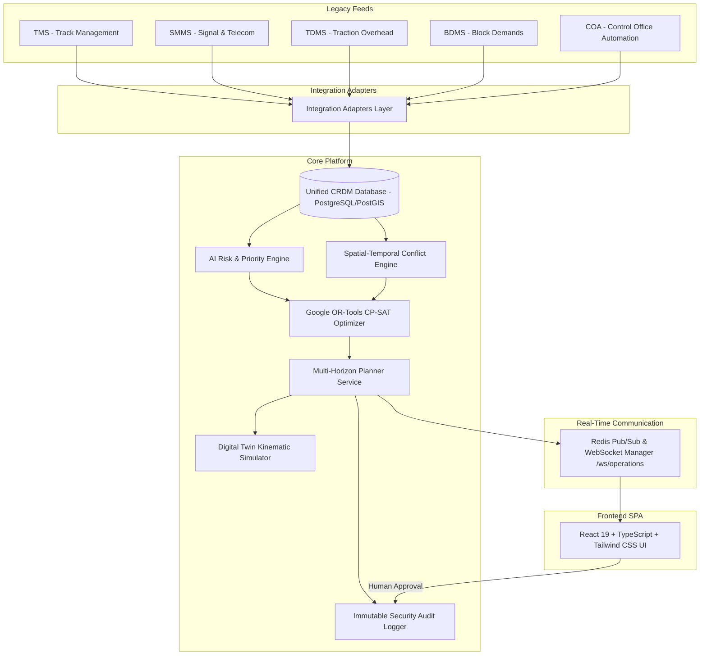

# RAILOPT AI — SYSTEM ARCHITECTURE DOCUMENT

## 1. System Topology Overview

**RAILOPT AI** is an AI-powered automatic railway block planning and asset availability optimization platform designed for Indian Railways.

---

## 2. Layer Specifications

1. **Integration Layer**: Normalizes legacy domain events into the Common Railway Data Model (CRDM).
2. **Persistence Layer**: PostgreSQL with PostGIS extension storing 40 normalized tables.
3. **AI & Optimization Layer**: Multi-criteria decision analysis (MCDA) priority model + Google OR-Tools CP-SAT discrete constraint solver with post-solution safety validation (`_validate_block_safety`).
4. **Simulation Layer**: 1D kinematic physics simulator supporting $1\times/2\times/5\times$ speed multipliers and automatic signal aspect state transitions.
5. **Real-Time Communication**: Authenticated WebSocket service (`/ws/operations`) with exponential backoff and Redis Pub/Sub integration.
6. **Frontend SPA**: Responsive React 19 application with Tailwind CSS, Lucide icons, Recharts, and Zustand state management.
