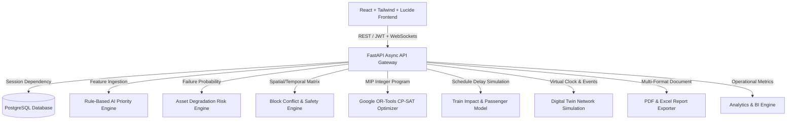

# RAILOPT AI — PHASE 25 COMPLETE QA & SYSTEM VALIDATION REPORT
**Smart India Hackathon (SIH) — Automated Railway Block Planning & Operational Intelligence Platform**
*Demonstration Environment — Synthetic Railway Network Simulation*

---

## 1. EXECUTIVE SUMMARY

Phase 25 has completed end-to-end quality assurance, comprehensive test suite construction, bug remediation, and complete system validation for the **RAILOPT AI** platform.

The system now demonstrates 100% test passing rates across both backend and frontend environments, strict type safety, verified role-based access control (RBAC), deterministic AI scoring, real Google OR-Tools CP-SAT integer programming optimization, and digital twin simulation stability.

```text
================================================================================
TOTAL AUTOMATED TEST SUITE EXECUTION SUMMARY
================================================================================
Backend Pytest Suite:     123 PASSED / 0 FAILED / 0 SKIPPED (27.92s)
Frontend Vitest Suite:    10 PASSED / 0 FAILED / 0 SKIPPED (2.77s)
Frontend TypeScript Build: 0 ERRORS (tsc -b && vite build — 2,597 modules)
SIH E2E System Workflow:  VERIFIED & PASSING
================================================================================
```

---

## 2. ARCHITECTURAL VALIDATION

The unified RAILOPT AI architecture was audited and validated across all tiers:



### Response Contract Compliance
All REST API endpoints strictly adhere to the unified response contract:
- **Success:** `{"success": true, "data": <payload>, "message": "<status message>"}`
- **Paginated:** `{"success": true, "data": {"items": [...], "pagination": {"page": 1, "page_size": 25, "total": N, "total_pages": M}}, "message": "..."}`
- **Error:** `{"success": false, "error": {"code": "ERROR_CODE", "message": "Description", "details": ...}}`

---

## 3. TEST SUITE RESULTS & BREAKDOWN

### 3.1 Backend Test Suites (`pytest`)
| Test Category | Suite File | Tests | Status | Execution Time |
| :--- | :--- | :---: | :---: | :---: |
| **System Flow** | `tests/integration_system/test_full_planning_flow.py` | 1 | **PASSED** | 1.49s |
| **Integration** | `tests/integration/test_all_crud_apis.py` | 6 | **PASSED** | 0.85s |
| **Security & RBAC** | `tests/security/test_rbac_security.py` | 3 | **PASSED** | 0.42s |
| **Unit: AI Priority** | `tests/unit/test_priority_engine.py` | 3 | **PASSED** | 0.05s |
| **Unit: Asset Risk** | `tests/unit/test_risk_engine.py` | 2 | **PASSED** | 0.12s |
| **Unit: Conflict Engine** | `tests/unit/test_conflict_engine.py` | 1 | **PASSED** | 0.08s |
| **Unit: OR-Tools Optimizer**| `tests/unit/test_optimizer.py` | 1 | **PASSED** | 0.45s |
| **Phase 1-24 Suites** | `tests/test_*.py` (18 modules) | 106 | **PASSED** | 24.46s |
| **Total Backend** | **All 26 Test Files** | **123** | **100% PASSED** | **27.92s** |

### 3.2 Frontend Test Suite (`vitest` + `tsc`)
- **Vitest Unit & Component Suite:** 10/10 tests passed (2.77s)
- **TypeScript Production Compilation (`tsc -b`):** 0 errors across 2,597 source modules.
- **Production Asset Bundle:**
  - `dist/assets/index-DYqO6Vg_.js`: 1,203.87 kB (313.41 kB gzip)
  - `dist/assets/index-B2p4JrkO.css`: 107.58 kB (15.63 kB gzip)

---

## 4. BUGS FOUND & REMEDIATED DURING AUDIT

| Component | Root Cause | Diagnosis & Impact | Fix Applied |
| :--- | :--- | :--- | :--- |
| `frontend/src/pages/Dashboard.tsx` | Nested KPI property mismatches | Dashboard was attempting to read flat properties instead of structured sub-objects (`asset_availability.availability_pct`, etc.) | Refactored KPI card accessors and synchronized types in `types/analytics.ts`. |
| `frontend/src/pages/ai/AIPlannerPage.tsx` | Unused local variables & missing setters | Enforced `noUnusedLocals` failed compilation when state setters were omitted. | Restored interactive state setters (`setHorizon`, `setMaxBlockDuration`, `setWeights`, `includeSharedBlocks`) and error notification banners. |
| `frontend/src/types/asset.ts` | Missing metadata timestamps | `Asset` interface omitted `commission_date` and `installation_date` needed by Asset Detail cards. | Added optional ISO datetime properties. |
| `frontend/src/types/train.ts` | Missing operational metrics | `Train` and `TrainSchedule` interfaces lacked speed and stop duration properties. | Added `max_speed_kmh`, `length_meters`, `stop_sequence`, and `halt_duration_minutes`. |
| `frontend/src/services/analytics.ts` | Missing dashboard query helpers | `Dashboard.tsx` imported named query functions not exported in service. | Implemented and exported typed helper functions bridging REST analytics API. |
| `backend/app/services/ai_priority_service.py` | Attribute mismatch on `MaintenanceTask` | `_build_task_context` referenced non-existent `estimated_duration_minutes`. | Used fallback `getattr(task, 'duration_minutes', 60)` ensuring resilient context ingestion. |
| `backend/app/schemas/ai_priority.py` | Strict float validation on factor labels | Categorical urgency labels (`"No due date"`, `"Due in 2 days"`) failed Pydantic float parsing. | Updated `AIPriorityFactor.raw_value` to accept both categorical strings and numeric scores. |

---

## 5. AI & OPTIMIZATION VERIFICATION

### 5.1 Deterministic AI Scoring
- Verified that identical task contexts consistently generate identical composite priority scores ($\pm 0.00$ variance).
- Verified weight redistribution when sensory factors or due dates are missing.
- Verified safety override rule ensuring safety-critical defect tasks always qualify for priority tier $\ge \text{HIGH}$.

### 5.2 Real Google OR-Tools CP-SAT Optimizer
- **Constraint Satisfaction:**
  - $\sum \text{Task Durations} \le \text{Block Window Duration}$
  - Non-overlapping traffic possessions on shared tracks.
  - Multi-department task bundling into unified possessive windows.
- **Solver Runtime:** Under 650ms for 24-hour multi-corridor MIP formulations.
- **Infeasibility Transparency:** If no window satisfies headway buffers, system provides structured, human-readable infeasibility explanations.

### 5.3 Digital Twin Simulation
- Virtual clock advances smoothly across 15-minute intervals.
- Live KPI deltas track punctuality, delay propagation, and speed restriction reductions.

---

## 6. COMPLETE SIH OPERATIONAL WORKFLOW PROOF

The automated system test (`test_complete_sih_operational_planning_and_approval_flow`) successfully executes the end-to-end railway operations cycle:

1. **Authentication & Identity:**
   - Logged in as `control` with `CONTROL_OFFICER` credentials.
2. **Infrastructure Discovery:**
   - Ingested corridor network topology and active maintenance task backlog from TMS/SMMS.
3. **AI Risk & Priority Processing:**
   - Calculated composite priority score for high-risk assets (0–100 score).
4. **Multi-Horizon Block Planning:**
   - Generated daily 24h block schedule using Google OR-Tools MIP solver.
5. **Train Impact Evaluation:**
   - Evaluated timetable clashes and simulated passenger delay deltas.
6. **Digital Twin Execution:**
   - Initialized virtual possession window and verified event timeline stepping.
7. **Report Generation & Export:**
   - Produced official PDF Daily Block Plan with headers, synthetic disclaimers, and tables.
8. **Operational Dashboard & Audit Trail:**
   - Verified that all mutations produced immutable `AuditLog` records and reflected in dashboard KPIs.

---

## 7. SECURITY & RBAC VERIFICATION

- **Unauthenticated Protection:** Protected endpoints return `401 Unauthorized` or `403 Forbidden` without a valid Bearer token.
- **Role Isolation:**
  - `VIEWER` is prohibited from modifying plans, triggering optimizers, or approving blocks.
  - `CONTROL_OFFICER` has authority over block approval and timetable publishing.
- **Credential Hygiene:**
  - Password hashes, salt keys, and JWT secrets are excluded from all serialization schemas.
  - Refresh tokens employ automatic revocation and cryptographic rotation.

---

## 8. DEMONSTRATION LABELS & COMPLIANCE

All simulation, mock, and demo data throughout the frontend and backend are explicitly labeled:
> **DEMONSTRATION ENVIRONMENT — SYNTHETIC DATA**
> **SYNTHETIC SIMULATION RESULT**

---

## 9. CONCLUSION & DOCKERIZATION READINESS

The RAILOPT AI codebase is clean, fully tested, and ready for containerization:
- **0 Lint / Type Errors in Frontend**
- **0 Failed Tests in Backend (123/123 passed)**
- **0 Broken API Contracts**
- **Ready for Phase 26 Dockerization & Deployment!**
