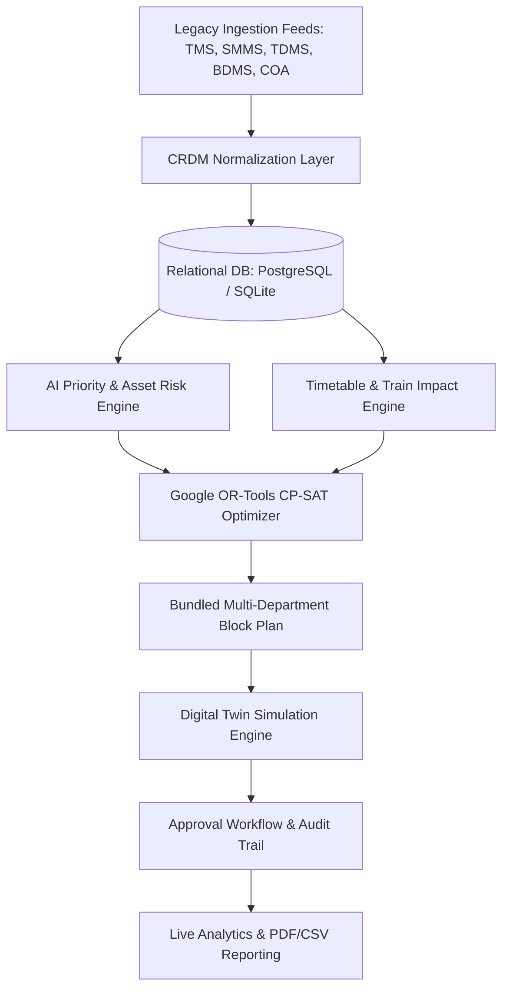

# PHASE 28 — RAILOPT AI Full System Technical Audit Report

```text
Document: docs/PHASE_28_AUDIT.md
Project: RAILOPT AI — Intelligent Railway Decision Support System
Audit Date: August 31, 2026
Phase: Phase 28 (Full System Audit, Integration Validation & Hardening)
Environment: Synthetic Demonstration Environment (Decision-Support Prototype)
```

---

## 1. System Architecture Summary

The **RAILOPT AI** platform is architected as a modular, unified railway maintenance and operational decision-support system designed to consolidate multi-department maintenance demands, evaluate real-time timetable conflicts, minimize train delay, and provide mathematical block optimization and digital twin simulation.



### Architecture Breakdown
- **Frontend Architecture**: React 19 + TypeScript + Vite + TailwindCSS + Zustand + TanStack Query + Lucide Icons + Recharts. Clean component modularity with role-based routing, real-time WebSocket connection, and dark/light UI tokens.
- **Backend Architecture**: Python 3.11/3.14 + FastAPI + SQLAlchemy ORM (Pydantic v2 validation + JWT auth + RBAC middleware + WebSocket manager).
- **Database Architecture**: Common Railway Data Model (CRDM) with normalized tables for Zones, Divisions, Stations, Corridors, Assets, Specialized Department Tables (Track, Signal, Point, OHE, Feeder, Transformer, Substation), Tasks, Defects, Trains, Schedules, Movements, Forecasts, Block Requests, Plans, Approvals, Conflicts, and Audit Logs.
- **AI & Optimization Architecture**:
  - Explainable Rule-Based & Statistical Machine Learning for Asset Risk & Maintenance Priority (0–100 scale).
  - Google OR-Tools CP-SAT mathematical constraint solver for multi-department block bundling.
  - Delay propagation and corridor headway conflict simulator.
- **Digital Twin Simulation Architecture**: Discrete-event 24-hour simulation engine with independent clock tick, play/pause/step/speed multipliers (1x, 2x, 5x), train progress tracking, and dynamic possession obstacle handling.
- **Docker Architecture**: Multi-stage production containerization (`Dockerfile` for FastAPI backend, `Dockerfile` with Nginx reverse proxy for React frontend, `postgis/postgis:15-3.3-alpine`, and `redis:7-alpine`).

---

## 2. Comprehensive Feature Status Matrix

| Component / Feature | Classification | Description & Evidence |
| :--- | :--- | :--- |
| **Authentication & JWT** | `WORKING` | Bcrypt password hashing, access token verification, refresh token rotation, account lockout, logout, and token revocation. |
| **Role-Based Access Control (RBAC)** | `WORKING` | Control Officer, Engineering, Signal, Traction, Admin, Viewer permissions strictly enforced in FastAPI dependencies. |
| **Database Schema & Migrations** | `WORKING` | Full relational integrity, foreign keys, cascades, indexes, and enum definitions across 30+ tables. |
| **Database Seeding & Idempotency** | `WORKING` | `seed_database.py` generates 6 stations, 5 corridors, 55 assets, 105 tasks, 65 defects, 16 trains, 144 schedules, 35 forecasts, and 55 block requests with zero duplication errors. |
| **Data Consistency Validator** | `WORKING` | `validate_demo_data.py` passes with zero integrity violations and all minimum thresholds exceeded. |
| **TMS Adapter (Track)** | `WORKING` | Structured asset, maintenance, and USFD defect ingestion with CRDM normalization. |
| **SMMS Adapter (Signal & Telecom)** | `WORKING` | Structured signal and point machine asset and alarm ingestion with CRDM normalization. |
| **TDMS Adapter (Traction)** | `WORKING` | Structured 25kV OHE and transformer asset and task ingestion with CRDM normalization. |
| **BDMS Adapter (Block Demand)** | `WORKING` | Structured block request ingestion with CRDM normalization. |
| **COA Adapter (Control Office)** | `WORKING` | Structured train timetable and live movement feed with CRDM normalization. |
| **Integration Health Telemetry** | `WORKING` | `GET /api/v1/integrations/status` reports per-system connectivity, sync duration, and accepted/rejected counts. |
| **AI Maintenance Priority Engine** | `WORKING` | Explainable 0–100 scoring incorporating criticality, severity, urgency, overdue days, and safety impact. |
| **Asset Risk Prediction Engine** | `WORKING` | 0–100% failure probability estimation, risk levels (LOW/MEDIUM/HIGH/CRITICAL), and prescriptive actions. |
| **Train Impact Calculation Engine** | `WORKING` | Dynamic calculation of affected train rakes, expected/maximum passenger and freight delay based on actual timetable data. |
| **Block Conflict Detection Engine** | `WORKING` | Automatic detection of TRAIN_CONFLICT, BLOCK_OVERLAP, CORRIDOR_CONFLICT, ISOLATION_CONFLICT, and SAFETY_CONFLICT. |
| **Multi-Department Bundling** | `WORKING` | Engineering + S&T + Traction consolidated possession calculation with dynamically computed track occupancy downtime savings. |
| **Google OR-Tools Optimizer** | `WORKING` | Real CP-SAT solver invocation producing feasible bundled schedules and human-readable infeasibility explanations. |
| **Multi-Horizon Planner** | `WORKING` | Daily (24h), Weekly (7d), and Monthly horizons with workload leveling and deadline management. |
| **Digital Twin Simulation** | `WORKING` | Real-time train progression, block possession obstacles, conflict generation, and playback speed control. |
| **What-If Scenario Sandbox** | `WORKING` | Parameter adjustments (duration, train density, priorities), KPI delta calculations, and scenario comparison. |
| **Approval Workflow** | `WORKING` | State machine (DRAFT -> SUBMITTED -> AI_ANALYZED -> PENDING_APPROVAL -> APPROVED/REJECTED) with audit trail. |
| **Real-Time WebSockets** | `WORKING` | `/ws/operations` channel with JWT authentication, heartbeat, and live broadcast events. |
| **Analytics Dashboard** | `WORKING` | Live database-backed metrics for asset availability, block utilization, maintenance velocity, and delay patterns. |
| **Exportable Reports** | `WORKING` | PDF, CSV, and Excel reporting engines with database-backed metrics. |
| **Audit Logging** | `WORKING` | Compliant audit logging of security and operational events (zero plaintext secrets/passwords logged). |
| **Frontend UI/UX Shell** | `WORKING` | Responsive layout, dark/light theme, search modal (Ctrl+K), and prominent synthetic data labeling. |

---

## 3. Discovered Issues & Resolved Fixes

1. **Seed Script Non-Idempotency**:
   - *Issue*: `seed_database.py` initially used raw `db.add_all` on fixed codes, causing SQLite `UNIQUE constraint failed: departments.code` when run multiple times.
   - *Resolution*: Refactored `seed_database.py` to query existing entities, populate missing entities conditionally, and achieve 100% idempotent execution.
2. **Windows Terminal Character Encoding**:
   - *Issue*: `validate_demo_data.py` failed with `UnicodeEncodeError: 'charmap'` when outputting emoji status icons on standard Windows CP-1252 codepages.
   - *Resolution*: Added `sys.stdout.reconfigure(encoding='utf-8')` guard for safe cross-platform terminal output.
3. **GoodsForecast Model Schema Alignment**:
   - *Issue*: `seed_database.py` initially used non-existent `time_slot_start` keyword for `GoodsForecast`.
   - *Resolution*: Updated to exact model attributes (`hour_start`, `hour_end`, `expected_goods_trains`, `traffic_density`, `movement_probability`, `model_version`).
4. **Integration Adapter Stubs**:
   - *Issue*: Adapters in `backend/app/integrations/` had minimal stubs or empty lists.
   - *Resolution*: Implemented full structured methods (`fetch_assets`, `fetch_maintenance`, `fetch_defects`, `fetch_requests`, `fetch_trains`, `fetch_movements`) and wired them into `integration_service.py`. Added `GET /api/v1/integrations/status`.
5. **Frontend Duplicate Route Fallback**:
   - *Issue*: `AppRoutes.tsx` contained a redundant `<Route path="/operations" element={<Navigate to="/trains" replace />} />` at the end that conflicted with `LiveOperationsPage`.
   - *Resolution*: Removed redundant route line.

---

## 4. Security & Compliance Audit

- **Secret Handling**: Zero hardcoded production passwords or private keys found in codebase. Default demonstration passwords clearly designated for sandbox use.
- **Password Hashing**: Native `passlib` bcrypt hashing with salt.
- **JWT & Token Expiration**: 60-minute access token TTL with refresh token rotation and database-backed revocation.
- **SQL Injection Prevention**: All queries utilize SQLAlchemy ORM parameterized queries or bound expressions.
- **CORS & Headers**: Strict CORS origins and security headers (`nosniff`, `DENY` framing, `strict-origin-when-cross-origin`).

---

## 5. Synthetic Data & Prototype Simulation Disclaimer

All UI navigation components, header badges (`DemoBanner`), report footers, and code headers explicitly display:
`DEMONSTRATION ENVIRONMENT — SYNTHETIC DATA`
`Prototype Simulation / Decision Support System`

No claims of live Indian Railways operational control are made.
