# RAILOPT AI — Phase 31.2 System Architecture & Data Pipeline Blueprint

**Route:** `/architecture`  
**Classification:** Smart India Hackathon (SIH) Technical Architecture Documentation  
**Implementation Status:** **100% VERIFIED & INTERACTIVE**  
**Date:** August 31, 2026

---

## 1. Executive Architectural Blueprint

RAILOPT AI integrates fragmented railway maintenance subsystems, train operational graphs, and asset telemetry into a cohesive mathematical optimization and decision-support pipeline.

```mermaid
flowchart TD
    subgraph L1["1. External Railway Systems & Feeds"]
        TMS["TMS (Track Geometry & Flaws)"]
        SMMS["SMMS (Point Machine & Relays)"]
        TDMS["TDMS (25kV OHE Catenary)"]
        BDMS["BDMS (Bridge Inspections)"]
        COA["COA (Section Train Graph)"]
        TIME["Timetable (NTES Express Schedules)"]
        GOODS["Goods Forecast (FOIS Freight Flows)"]
    end

    subgraph L2["2. Ingestion & Standardization Layer"]
        INGEST["FastAPI Integration Orchestrator + Normalization"]
    end

    subgraph L3["3. Unified Railway Data Model (URDM / CRDM)"]
        DB[("PostgreSQL 16 + PostGIS (50 Tables)")]
    end

    subgraph L4["4. AI Operational Intelligence"]
        PRIO["AI Priority Ranking (0-100)"]
        RISK["Asset Degradation & Failure Risk"]
        CONF["9-Class Spatial-Temporal Conflict Engine"]
        IMP["Train Impact & Headway Variance Estimator"]
    end

    subgraph L5["5. Mathematical Optimization Core"]
        CP["Google OR-Tools CP-SAT Integer Solver"]
    end

    subgraph L6["6. Multi-Horizon Planning Engine"]
        BUNDLE["Shared Block Bundler (ENG + SIG + TRC)"]
    end

    subgraph L7["7. Digital Twin Simulation"]
        TWIN["Discrete-Event Kinematics Simulation"]
    end

    subgraph L8["8. Human-in-the-Loop Governance"]
        AUTH["Control Officer Review (RBAC + Cryptographic Audit)"]
    end

    subgraph L9["9. Command Center & Telemetry"]
        DASH["Executive Dashboard + PDF Engine + WebSocket Bus"]
    end

    L1 --> INGEST
    INGEST --> DB
    DB --> L4
    L4 --> CP
    CP --> BUNDLE
    BUNDLE --> TWIN
    TWIN --> AUTH
    AUTH --> DASH
```

---

## 2. Layer-by-Layer Technical Specification

$$\begin{array}{|l|l|l|l|l|}
\hline
\textbf{Layer} & \textbf{Component} & \textbf{Inputs} & \textbf{Outputs} & \textbf{Status} \\
\hline
\text{1. Data Feeds} & \text{TMS (Track Management)} & \text{USFD Flaws, Track Car Geometry} & \text{TrackAsset, Defect records} & \text{SIMULATED DATA} \\
\text{1. Data Feeds} & \text{SMMS (Signalling)} & \text{Point machine strokes, Relay logs} & \text{SignalAsset, Overdue tasks} & \text{SIMULATED DATA} \\
\text{1. Data Feeds} & \text{TDMS (Traction 25kV)} & \text{OHE stagger, Substation feeds} & \text{TractionAsset, Power limits} & \text{SIMULATED DATA} \\
\text{1. Data Feeds} & \text{BDMS (Bridge Records)} & \text{Girder stress, Pier scour depth} & \text{BridgeAsset, Speed limits} & \text{SIMULATED DATA} \\
\text{1. Data Feeds} & \text{COA (Train Tracking)} & \text{Live GPS, Train charting feeds} & \text{Headway occupancy vectors} & \text{SIMULATED DATA} \\
\text{1. Data Feeds} & \text{Timetables} & \text{NTES schedules, Headway rules} & \text{TrainSchedule database records} & \text{SYNTHETIC DATA} \\
\text{1. Data Feeds} & \text{Goods Forecast} & \text{FOIS rake demands, Coal paths} & \text{GoodsForecast traffic density} & \text{SYNTHETIC DATA} \\
\hline
\text{2. Integration} & \text{Sync Orchestrator} & \text{Raw JSON/GeoJSON feeds} & \text{Validated domain schemas} & \mathbf{IMPLEMENTED} \\
\hline
\text{3. URDM Model} & \text{PostgreSQL 16 + PostGIS} & \text{Domain entities} & \text{50 Relational tables with FKs} & \mathbf{IMPLEMENTED} \\
\hline
\text{4. AI Modeling} & \text{AI Priority Ranking} & \text{Safety index, Overdue days} & \text{AIPriorityScore (0--100)} & \mathbf{IMPLEMENTED} \\
\text{4. AI Modeling} & \text{Asset Failure Risk} & \text{GMT tonnage, Cycles, Age} & \text{Failure Probability (0.0--1.0)} & \mathbf{IMPLEMENTED} \\
\text{4. AI Modeling} & \text{Conflict Detection} & \text{Window, Timetable, Power} & \text{9-Class Conflict Matrix} & \mathbf{IMPLEMENTED} \\
\text{4. AI Modeling} & \text{Train Delay Estimator} & \text{Possession corridor, Schedules} & \text{Expected delay minutes} & \mathbf{IMPLEMENTED} \\
\hline
\text{5. Solver Core} & \text{Google OR-Tools CP-SAT} & \text{Task pool, Feasible windows} & \text{Exact optimal BlockPlan} & \mathbf{IMPLEMENTED} \\
\hline
\text{6. Planning} & \text{Shared Block Bundler} & \text{CP-SAT solution, Dept rosters} & \text{Bundled ENG + SIG + TRC blocks} & \mathbf{IMPLEMENTED} \\
\hline
\text{7. Digital Twin} & \text{Kinematics Engine} & \text{Topology, Trains, Blocks} & \text{Stepwise dynamic state (1x--60x)} & \mathbf{IMPLEMENTED} \\
\hline
\text{8. Governance} & \text{RBAC Authorization} & \text{Officer Decision (Approve/Reject)} & \text{Immutable Audit Log Token} & \mathbf{IMPLEMENTED} \\
\hline
\text{9. Analytics} & \text{Executive Dashboard} & \text{Live DB & Simulation Telemetry} & \text{Command Center UI & PDF Reports} & \mathbf{IMPLEMENTED} \\
\hline
\end{array}$$

---

## 3. Interactive Web Architecture Route (`/architecture`)

The `/architecture` page provides an interactive visual blueprint featuring:
1. **Multi-Layer Architectural Canvas:** Organizes all 19 subsystem components into clearly delineated flow bands.
2. **Layer Filter Switcher:** Instantly focuses on Data Sources, Core Model, AI & Optimization, or Digital Twin Governance.
3. **Deep Component Inspector:** Clicking on any component reveals:
   - Component Name & Tier
   - Purpose & Operational Context
   - Upstream Data Inputs
   - Downstream Data Contracts
   - Underlying Technology Stack & Mathematical Formulations
   - Explicit Implementation Status Flag
   - Technical Safety Boundaries

---

## 4. Technical Honesty & Safety Governance Disclaimers

The architecture visualization explicitly differentiates:
- **`IMPLEMENTED`**: Real operational code running live within the backend container (Google OR-Tools CP-SAT integer solver, PostgreSQL PostGIS relational schema, RBAC security layer, discrete-event Digital Twin).
- **`IMPLEMENTED — SIMULATED / SYNTHETIC DATA`**: Data adapters ingest verified synthetic schemas matching real Indian Railways TMS, SMMS, TDMS, and COA formats.
- **`FUTURE APPROVED INTEGRATION`**: Direct field telemetry integration with live CRIS production systems upon operational deployment.

> [!IMPORTANT]
> **SAFETY BOUNDARY:** RAILOPT AI is an AI-assisted decision-support platform for railway engineers and Section Control Officers. It does not interface directly with field relay interlocks or autonomously clear physical railway signals.
