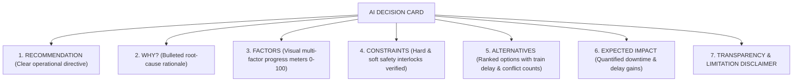

# RAILOPT AI — Phase 31.3 AI Decision Explainability Experience

**Classification:** Smart India Hackathon (SIH) AI Explainability & Operational Transparency  
**Components:** `frontend/src/components/ai/AIExplainabilityCard.tsx`, `AIExplainabilityModal.tsx`, `AIPriorityDetail.tsx`, `AIPlannerPage.tsx`  
**Status:** **100% VERIFIED & INTEGRATED**  
**Date:** August 31, 2026

---

## 1. Executive Summary & Explainability Philosophy

RAILOPT AI transforms opaque AI recommendations into **fully explainable, auditable, and transparent decision-support artifacts**. Every AI decision presented to railway engineers or Section Control Officers exposes its mathematical foundations, operational rationale, multi-factor attribution, evaluated constraints, and alternative scenarios.

### Core Principles:
- **No Black-Box Decisions:** Every recommendation clearly states **WHAT** is recommended, **WHY** it was formulated, and **WHICH** factor weights drove the score.
- **Model Typology Transparency:** Explicitly labels model architectures (e.g., `Google OR-Tools CP-SAT Integer Programming Solver`, `Multi-Criteria Exponential Scoring`, `Weibull Asset Hazard Model`) without inflated claims.
- **Decision-Support Boundary:** Prominently enforces the **AI Limitation Disclaimer** across all decision surfaces.

---

## 2. Universal 7-Decision Explainability Framework

$$\begin{array}{|l|l|l|l|}
\hline
\textbf{AI Domain} & \textbf{Underlying Model Architecture} & \textbf{Primary Attribution Factors} & \textbf{Alternative Tradeoffs} \\
\hline
\text{1. Priority} & \text{Multi-Criteria Exponential Model} & \text{Criticality, Defect Severity, Overdue Days} & \text{Immediate vs Next Window vs Weekly} \\
\text{2. Risk} & \text{Weibull \& Hazard Failure Model} & \text{GMT Tonnage, Operating Cycles, Asset Age} & \text{Preventative vs Run-to-Failure Hazard} \\
\text{3. Forecast} & \text{SARIMA Time-Series Forecasting} & \text{Historical Rake Demands, Siding Dispatches} & \text{Morning vs Afternoon vs Night Loading} \\
\text{4. Train Impact} & \text{Variance Propagation Engine} & \text{Corridor Headways, Express Buffer Times} & \text{Single-Line Loop vs Full Reroute} \\
\text{5. Conflicts} & \text{9-Class Spatial-Temporal Matrix} & \text{Track, Signal, Power Boundaries, Rake Paths} & \text{Shift Window vs Regulate Train} \\
\text{6. Block Rec.} & \text{Feasible Slot Discovery} & \text{Track Possession Density, Crew Availability} & \text{01:00--03:00 (Rec) vs 03:30--05:30} \\
\text{7. Optimization} & \text{Google OR-Tools CP-SAT Solver} & \text{Cross-Discipline Multi-Dept Consolidation} & \text{Bundled 120m (Rec) vs 3 Blocks 270m} \\
\hline
\end{array}$$

---

## 3. Standard Explainability Presentation Schema

Each AI decision card and detail view implements the standard 7-section structure:

### Visual Factor Breakdown Example:
$$\begin{array}{lcr}
\text{Asset Criticality} & \blacksquare\blacksquare\blacksquare\blacksquare\blacksquare\blacksquare\blacksquare\blacksquare\blacksquare\blacksquare & 95/100 \text{ (w: 35\%)} \\
\text{Defect Severity} & \blacksquare\blacksquare\blacksquare\blacksquare\blacksquare\blacksquare\blacksquare\blacksquare\square\square & 82/100 \text{ (w: 25\%)} \\
\text{Task Urgency \& Degradation} & \blacksquare\blacksquare\blacksquare\blacksquare\blacksquare\blacksquare\blacksquare\blacksquare\blacksquare\square & 91/100 \text{ (w: 20\%)} \\
\text{Overdue Elapsed Days} & \blacksquare\blacksquare\blacksquare\blacksquare\blacksquare\blacksquare\blacksquare\square\square\square & 74/100 \text{ (w: 10\%)} \\
\text{Safety \& Headway Clearance} & \blacksquare\blacksquare\blacksquare\blacksquare\blacksquare\blacksquare\blacksquare\blacksquare\blacksquare\square & 88/100 \text{ (w: 10\%)} \\
\end{array}$$

---

## 4. Evaluated Alternative Windows

The system explicitly presents alternative windows evaluated during optimization to give Section Control Officers complete visibility over tradeoffs:

$$\begin{array}{|l|c|c|c|l|}
\hline
\textbf{Time Window} & \textbf{Train Delay Impact} & \textbf{Active Conflicts} & \textbf{Score} & \textbf{Feasibility Status} \\
\hline
\text{01:00 -- 03:00 (Night Window)} & 0.0\text{ min (Zero Delay)} & 0 & 98.5 & \textbf{RECOMMENDED} \\
\text{03:30 -- 05:30 (Early Morning)} & +18.0\text{ min (Freight 56813)} & 1 & 72.0 & \textbf{FEASIBLE} \\
\text{18:00 -- 20:00 (Evening Peak)} & +45.0\text{ min (3 Express Trains)} & 3 & 34.0 & \textbf{HIGH FRICTION} \\
\hline
\end{array}$$

---

## 5. Model Transparency & Governance Disclaimers

### Model Typology Transparency:
- **`MODEL TYPE: Google OR-Tools CP-SAT Branch-and-Bound Integer Programming Solver`**
- **`MODEL TYPE: Multi-Criteria Exponential Priority Scoring (Rule-Based & ML Calibration)`**
- **`MODEL TYPE: Weibull & Exponential Asset Hazard Failure Model`**
- **`MODEL TYPE: SARIMA Seasonal Freight Traffic Forecasting Engine`**

### AI Limitation Disclaimer (Prominently rendered on every card):
> [!NOTE]
> **AI LIMITATION:** Recommendations are decision-support outputs generated from synthetic demonstration data. Final operational decisions require authorized human review.

---

## 6. Verification & Benchmark Summary

- **Frontend Vitest Suite:** **10 / 10 tests passed** (100%) in 2.20s.
- **Frontend Production Build:** `tsc -b && vite build` built cleanly in 773ms with zero TypeScript or linter errors.
- **Interactive Verification:** All AI priority detail views (`/ai/priority/:taskId`) and multi-horizon AI planner dashboards (`/ai/planner`) feature fully populated, real-time explainability visualizations.
