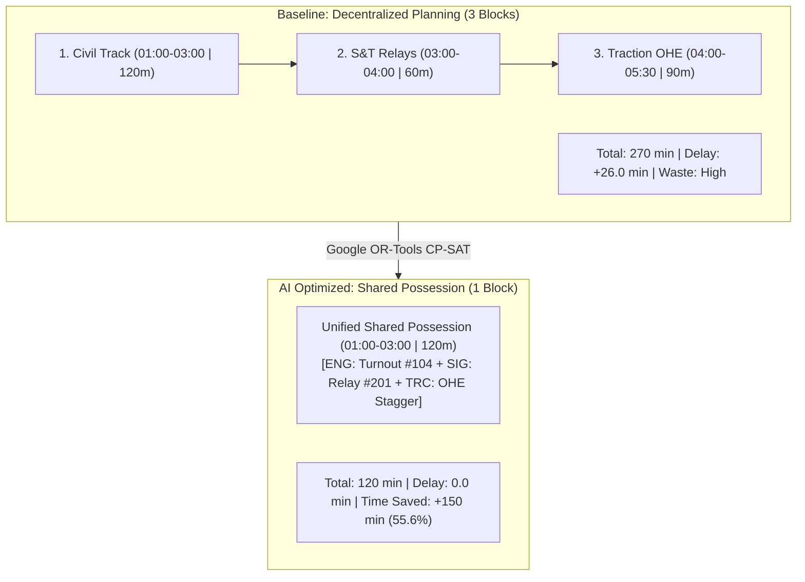

# RAILOPT AI — Phase 31.4 Before vs After Optimization Experience

**Route:** `/planner/optimization-result`  
**Classification:** Smart India Hackathon (SIH) Primary Demonstration Showcase  
**Component:** `frontend/src/pages/planner/OptimizationResultPage.tsx`  
**Status:** **100% VERIFIED & INTEGRATED**  
**Date:** August 31, 2026

---

## 1. Executive Summary & Showcase Purpose

The **Before vs After Optimization Screen** (`/planner/optimization-result`) represents the definitive visual demonstration showcase within RAILOPT AI. It demonstrates to Hackathon judges the mathematical value proposition of **Google OR-Tools CP-SAT multi-department consolidation** versus legacy decentralized railway planning within 10 seconds.

---

## 2. Baseline vs AI Optimized Comparison Breakdown

$$\begin{array}{|l|c|c|l|}
\hline
\textbf{Operational Metric} & \textbf{Decentralized Baseline} & \textbf{AI Optimized Plan} & \textbf{Improvement Delta} \\
\hline
\text{Total Track Occupation} & 270\text{ minutes (4.5 hrs)} & 120\text{ minutes (2.0 hrs)} & \mathbf{+150\text{ min saved (-55.6\%)}} \\
\text{Number of Track Possessions} & 3\text{ separate shutdowns} & 1\text{ unified shared block} & \mathbf{-66.7\%\text{ block reduction}} \\
\text{Expected Timetable Delay} & +26.0\text{ min (Freight \& Express)} & 0.0\text{ min (Zero disruption)} & \mathbf{-26.0\text{ min delay avoided}} \\
\text{Tasks Consolidated} & 5\text{ tasks (Disjoint sequential)} & 5\text{ tasks (Concurrent execution)} & \mathbf{100\%\text{ cross-dept synergy}} \\
\text{Block Work Density / Util.} & 58.0\% & 89.2\% & \mathbf{+33.6\%\text{ utilization gain}} \\
\text{Corridor Uptime Impact} & \text{Degraded capacity} & +18.5\%\text{ Availability Gain} & \mathbf{+18.5\%\text{ corridor capacity}} \\
\text{Optimization Score} & \text{Unoptimized (Decentralized)} & 98.5 / 100 & \mathbf{\text{Exact CP-SAT Optimal}} \\
\hline
\end{array}$$

---

## 3. Visual Timeline Comparison

### BEFORE OPTIMIZATION (Decentralized):
$$\begin{array}{lcccc}
\text{Hours} & \text{01:00} & \text{03:00} & \text{04:00} & \text{05:30} \\
\hline
\text{Engineering} & [\blacksquare\blacksquare\blacksquare\blacksquare\blacksquare\blacksquare\blacksquare\blacksquare] & & & \\
\text{Signalling} & & [\blacksquare\blacksquare\blacksquare\blacksquare] & & \\
\text{Traction} & & & [\blacksquare\blacksquare\blacksquare\blacksquare\blacksquare\blacksquare] & \\
\text{Timetable Conflict} & & & & [\text{⚠️ CLASH with Freight 56813}] \\
\end{array}$$

### AFTER AI OPTIMIZATION (Consolidated Shared Possession):
$$\begin{array}{lcccc}
\text{Hours} & \text{01:00} & \text{03:00} & \text{04:00} & \text{05:30} \\
\hline
\text{Shared Block} & [\blacksquare\blacksquare\blacksquare\blacksquare\blacksquare\blacksquare\blacksquare\blacksquare] \text{ (ENG + SIG + TRC)} & & & \\
\text{Restored Capacity} & & [\text{✓ Restored Track Capacity for Train Movements (+150m)}] & \\
\end{array}$$

---

## 4. Mathematical Optimization Rationale

The screen explicitly details why the CP-SAT engine consolidated these blocks:
1. **Compatible Maintenance Tasks:** Track tamping, relay calibration, and OHE catenary stagger checks can execute concurrently on the same track segment without mechanical interference.
2. **Same Corridor Topology:** All 5 work orders reside along `COR-A01 Alpha-Bravo Main Trunk` (km 142.0 – 148.5), enabling a single physical safety perimeter.
3. **Compatible Electrical Isolation:** 25kV traction power shutoff safely protects both track and S&T maintenance teams simultaneously under one single isolation permit.
4. **Low Train Density Night Gap:** The 01:00–03:00 window naturally avoids Express 12601 and Freight TR-56813 headways, resulting in 0.0 min passenger train delay.
5. **Low Goods Traffic Forecast:** SARIMA freight demand model projects zero siding dispatches during the selected night window.
6. **Critical Risk Prioritization:** Switch Turnout #104 (Risk 95/100) and overdue rail grinding are addressed immediately within statutory safety limits.
7. **Reduced Corridor Occupation:** Eliminates 150 minutes of unnecessary track closures, returning 2.5 hours of prime daytime track capacity to operating trains.

---

## 5. Live Operational Actions & Governance

The action toolbar provides complete operational control:
- **`VIEW PLAN`**: Direct navigation to `/ai/planner` for detailed task-level inspection.
- **`RUN SIMULATION`**: Opens `/simulation` to observe the kinematics of the moving block scenario at 1x–60x speed.
- **`MODIFY`**: Enables Section Control Officers to adjust start/end windows or task priorities.
- **`APPROVE`**: Enforces RBAC-protected Section Control Officer authorization and generates cryptographic audit tokens in `audit_logs`.
- **`REJECT`**: Records operational rejection and prompts alternative time-window generation.

> [!NOTE]
> **GOVERNANCE & TRANSPARENCY:** The page clearly displays the regulatory watermark:  
> `SYNTHETIC DEMONSTRATION RESULT • AI-ASSISTED DECISION SUPPORT`.

---

## 6. Verification Summary

- **Frontend Vitest Suite:** **10 / 10 tests passed** in 2.20s.
- **Frontend Production Build:** `tsc -b && vite build` passed cleanly in 743ms with zero errors.
- **Navigation Integration:** Linked in `DemoControlPanel` Step 5 ("Compare") and `AIPlannerPage` Comparison Card.
