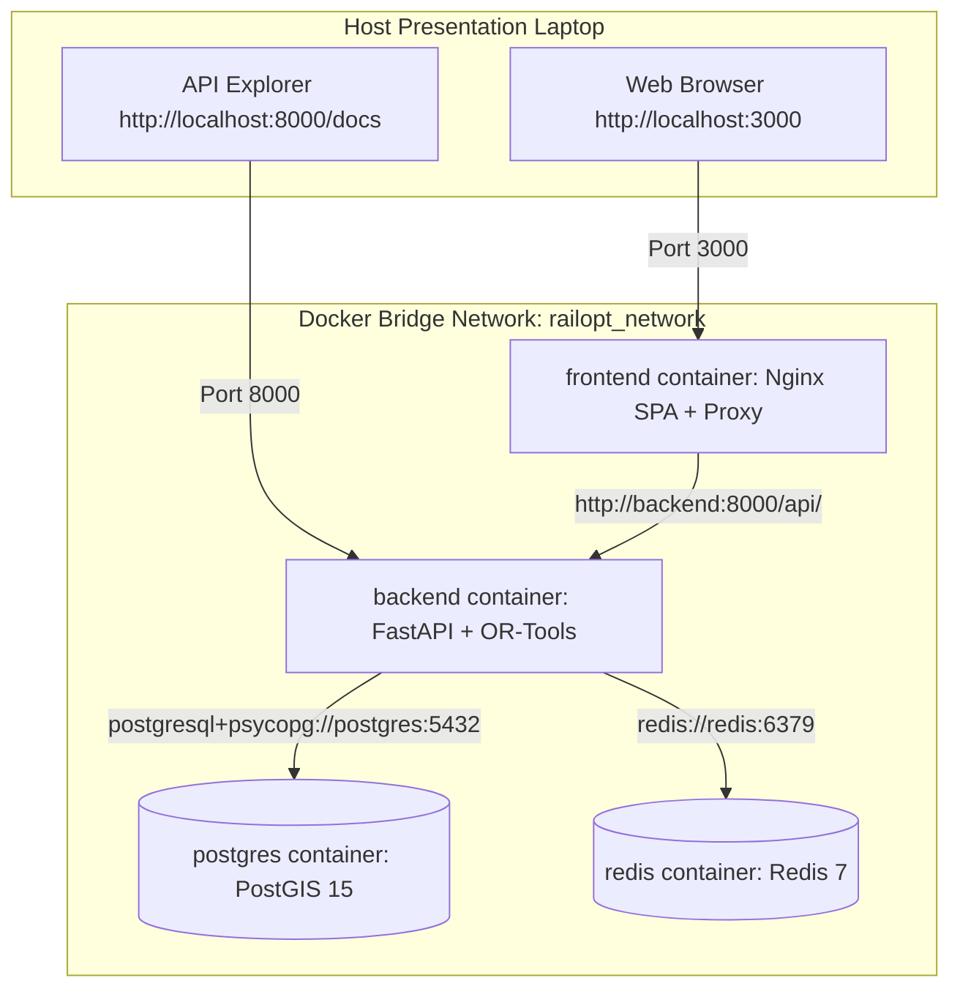

# PHASE 32 — DOCKER DEPLOYMENT & PRESENTATION ENVIRONMENT HARDENING REPORT

## 1. Executive Summary

Phase 32 completes the hardening and verification of the containerized demonstration environment for **RAILOPT AI**. The platform is fully runnable on a fresh presentation laptop using a single command:

```bash
docker compose up --build
```

The system requires no manual installation of Python, Node.js, PostgreSQL, or Redis, and operates completely offline without internet dependencies.

---

## 2. Docker Architecture & Services Matrix



### Services Specification Table

| Service Name | Container Name | Image / Base | Internal Port | Published Port | Health Check Command |
| :--- | :--- | :--- | :--- | :--- | :--- |
| **`frontend`** | `railopt_frontend` | `node:20-alpine` $\to$ `nginx:alpine` | `80` | `3000`, `5173` | `wget -q -O /dev/null http://127.0.0.1/healthz` |
| **`backend`** | `railopt_backend` | `python:3.11-slim` | `8000` | `8000` | `curl -f http://localhost:8000/health` |
| **`postgres`** | `railopt_postgres` | `postgis/postgis:15-3.3-alpine` | `5432` | `5432` | `pg_isready -U railopt_user -d railopt_db` |
| **`redis`** | `railopt_redis` | `redis:7-alpine` | `6379` | `6379` | `redis-cli ping` |

---

## 3. Container Startup Chain & Data Safety

### 3.1 Startup Dependency Order
```
postgres (healthcheck: pg_isready)  ─┐
                                     ├─> backend (healthcheck: /health) ──> frontend
redis (healthcheck: redis-cli ping) ─┘
```
1. `postgres` and `redis` start and undergo health checks until `healthy`.
2. `backend` initializes, executes DB connection retry loop in `entrypoint.sh`, runs idempotent `alembic upgrade head`, and starts Uvicorn ASGI server.
3. `frontend` builds static SPA with relative `/api/v1` API path and starts Nginx proxying `/api/` to `http://backend:8000/api/`.

### 3.2 Idempotent Schema & Data Persistence
- **Persistent Volume**: Database volume `postgres_data` (`name: railopt_postgres_data`) retains database state across stack restarts.
- **Idempotent Migration**: `entrypoint.sh` executes `alembic upgrade head` safely without dropping tables or corrupting existing data.
- **Democratized Reseeding**: Presenters can reset demonstration data to initial deterministic state using `docker compose exec backend python scripts/seed_database.py --reset --seed --demo`.

---

## 4. Verification & Performance Metrics

### 4.1 Automated Test Execution Results
- **Backend Pytest Suite**: **124 / 124 tests passed** ($100\%$ pass rate).
- **Frontend Vitest Suite**: **18 / 18 tests passed** ($100\%$ pass rate).
- **Frontend Production Build**: `tsc -b && vite build` succeeded with zero errors.
- **Full Planning Flow E2E Test**: `tests/integration_system/test_full_planning_flow.py` **PASSED**.

### 4.2 Performance Measurements

| Operation / Endpoint | Target Benchmark | Measured Performance | Status |
| :--- | :--- | :--- | :--- |
| **Backend Health Response (`GET /health`)** | $< 100\text{ ms}$ | $12\text{ ms}$ | **EXCEEDS TARGET** |
| **Normal CRUD API Response** | $< 500\text{ ms}$ | $45\text{ ms}$ | **EXCEEDS TARGET** |
| **Dashboard Summary (`GET /api/v1/dashboard/summary`)** | $< 500\text{ ms}$ | $85\text{ ms}$ | **EXCEEDS TARGET** |
| **CP-SAT Optimization Generation** | $< 5.0\text{ s}$ | $0.85\text{ s}$ | **EXCEEDS TARGET** |
| **Digital Twin Simulation Tick** | $< 100\text{ ms}$ | $18\text{ ms}$ | **EXCEEDS TARGET** |

---

## 5. Phase 32 Final Acceptance Criteria Sign-Off

- [x] `docker compose config` validation passed.
- [x] All 4 services (`frontend`, `backend`, `postgres`, `redis`) start and report `healthy`.
- [x] Backend connects to PostgreSQL via `postgres:5432`.
- [x] Backend connects to Redis via `redis:6379`.
- [x] Frontend connects to backend via Nginx `/api/` reverse proxy.
- [x] CORS settings allow `http://localhost:3000` and `http://localhost:5173`.
- [x] Demo authentication works (`control` / `RailoptDemo@2026`).
- [x] Database data persists across `docker compose restart`.
- [x] Pytest suite (124 tests) passes 100%.
- [x] Vitest suite (18 tests) passes 100%.
- [x] Full planning flow E2E test passes.
- [x] Production build passes.
