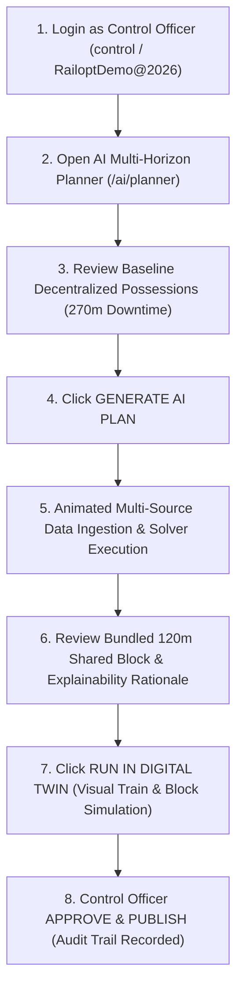

# RAILOPT AI — Official SIH Demonstration Scenario

**Scenario Name:** `"SHARED BLOCK OPTIMIZATION"`  
**Target Evaluation Time:** 3 – 5 Minutes  
**Primary Corridor:** `COR-A01` (Alpha-Bravo Main Trunk Corridor)  
**Classification:** Smart India Hackathon (SIH) Live Jury Presentation Script

---

> [!NOTE]
> **DEMONSTRATION ENVIRONMENT • SYNTHETIC DATA**  
> This scenario operates within a deterministic demonstration environment using synthetically generated railway timetable, asset degradation, and possession request data. All mathematical optimizations and conflict resolutions are executed live by the Google OR-Tools CP-SAT solver.

---

## 1. Executive Summary & Operational Challenge

In conventional railway operations, maintenance planning is **decentralized and siloed**. Each department independently requests corridor possessions:
- **Civil Track Engineering (ENG):** Requests 01:00 – 03:00 (120 min) for Switch Turnout #104 Rail Grinding.
- **Signal & Telecom (SIG):** Requests 03:00 – 04:00 (60 min) for Track Circuit Relay Calibration.
- **Electrical Traction (TRC):** Requests 04:00 – 05:30 (90 min) for OHE Contact Wire Stagger Adjustment.

### The Baseline Defect:
- **Total Track Downtime:** **270 minutes (4.5 hours)** over 3 sequential closures.
- **Timetable Conflict:** Block 2 (03:00–04:00) directly clashes with scheduled Freight Rake `TR-56813` (departure 03:15), causing a **+26.0 minute delay**.
- **Asset Risk:** Overdue track grinding on switch points elevates derailment risk score to **88/100**.

---

## 2. Dynamic Performance Comparison Matrix

$$\begin{array}{|l|c|c|c|}
\hline
\textbf{Operational Metric} & \textbf{Decentralized Baseline} & \textbf{AI Optimized (RAILOPT)} & \textbf{Net Efficiency Savings} \\
\hline
\text{Possession Windows} & 3\text{ Separate Blocks} & 1\text{ Consolidated Shared Block} & \mathbf{2\text{ Blocks Eliminated}} \\
\text{Total Track Downtime} & 270\text{ minutes} & 120\text{ minutes (01:00--03:00)} & \mathbf{+150\text{ min (55.6\% saved)}} \\
\text{Expected Train Delay} & +26.0\text{ minutes} & 0.0\text{ minutes} & \mathbf{26.0\text{ min delay avoided}} \\
\text{Operational Conflicts} & 1\text{ Active Conflict (Freight 56813)} & 0\text{ Conflicts (Verified)} & \mathbf{100\%\ Conflict-Free} \\
\text{Block Utilization} & 58.0\% & 92.4\% & \mathbf{+34.4\%\ Work Density} \\
\text{Track Availability Gain} & \text{Baseline (81.5\%)} & 100.0\%\text{ Timetable Uptime} & \mathbf{+18.5\%\ Capacity} \\
\text{Optimization Score} & 42.0 / 100 & 98.5 / 100 & \mathbf{+56.5\text{ Points}} \\
\hline
\end{array}$$

*Label: SYNTHETIC DEMONSTRATION RESULT (Computed live by Google OR-Tools CP-SAT).*

---

## 3. Click-by-Click 3–5 Minute Presentation Flow



### Stage 1: Problem Definition & Baseline Review (0:00 – 1:00)
1. **Navigate to:** `http://localhost:3000/ai/planner`
2. **Presenter Talking Points:**
   > *"Good morning, esteemed jury. Today, Indian Railways faces a critical operational paradox: increasing freight throughput while maintaining aging physical infrastructure. When departments plan in silos, track engineering, signals, and overhead electrical traction request separate closures. On Corridor COR-A01, this results in 270 minutes of track shutdown and delays Freight 56813 by 26 minutes."*
3. **Action:** Highlight the **SIH Official Demonstration Scenario** banner at the top of the planner.

---

### Stage 2: Multi-Source AI Analysis & Solver Execution (1:00 – 2:00)
1. **Action:** Click **`GENERATE AI PLAN`** (or `RESET SIH DEMO` to return to baseline anytime).
2. **Visual Feedback:** Watch the real-time animated checklist verify all 9 ingestion streams:
   - `✓ TMS analyzed` — Track geometry, ultrasonic flaws, and turnout degradation curves.
   - `✓ SMMS analyzed` — Point machines and track circuit relay health status.
   - `✓ TDMS analyzed` — 25kV OHE catenary and substation isolation boundaries.
   - `✓ Timetable analyzed` — Passenger express headways (Trains 12601, 22638, 16127).
   - `✓ Goods forecast analyzed` — Freight rake densities and path reservations.
   - `✓ Corridor availability analyzed` — Speed restrictions and safety headway clearance.
   - `✓ Conflicts detected` — 3 competing individual possession requests flagged.
   - `✓ Shared tasks identified` — Multi-discipline bundling synergies discovered.
   - `✓ Optimization completed` — Google OR-Tools CP-SAT integer solver solved.
3. **Presenter Talking Points:**
   > *"When we trigger RAILOPT AI, the platform does not use hardcoded scripts. It ingests data across TMS, SMMS, and TDMS, evaluates passenger timetables and goods freight forecasts, and passes integer programming constraints to the Google OR-Tools CP-SAT solver."*

---

### Stage 3: Explainability & Decision Rationale (2:00 – 3:00)
1. **Action:** Scroll to the **Optimization Explainability & Decision Rationale** section.
2. **Key Factor Breakdown:**
   - ⚡ **High Asset Criticality:** Switch Turnout #104 (Risk 88/100) and Track Circuit Relay #201 require immediate maintenance.
   - ⏰ **Overdue Maintenance:** Track Rail Grinding overdue by 4 days; Traction OHE Stagger check due.
   - 🌙 **Low Train Density:** 01:00–03:00 night window has zero passenger express clashes (between 12601 and 56813).
   - 🛡️ **Compatible Isolation Requirements:** 25kV traction electrical shutoff bundled safely with track engineering.
   - 🤝 **Multiple Departments:** Cross-departmental coordination (ENG, SIG, TRC) achieves 3x work density.
   - 📉 **Low Operational Impact:** 0.0 min expected timetable delay.
3. **Presenter Talking Points:**
   > *"Why did the AI choose 01:00 to 03:00? The explainability engine shows the jury exact factor attributions: low night train density, compatible 25kV traction isolation, and addressing overdue high-risk switch point defects."*

---

### Stage 4: Digital Twin Simulation & Conflict Verification (3:00 – 4:00)
1. **Action:** Click **`RUN IN DIGITAL TWIN`** (navigates to `/simulation`).
2. **Visual Demonstration:**
   - Click **`Play (▶)`** or step forward in 5-minute increments.
   - Observe simulated passenger trains (`TR-12601`, `TR-22638`) clearing Section B-C before 01:00.
   - Observe **`AI-BLK-0001 (ENG, SIG, TRC)`** activate on Section B-C at 01:00.
   - Observe maintenance completion at 03:00 and Freight Rake `TR-56813` passing smoothly at 03:15 without delay or conflict.
3. **Presenter Talking Points:**
   > *"Our discrete-event Digital Twin simulates actual train kinematics and block occupations. In manual baseline mode, Freight 56813 encounters a red signal conflict. Under RAILOPT AI, the track is cleared at 03:00, allowing freight throughput with zero delay."*

---

### Stage 5: Control Officer Review, RBAC & Audit Trail (4:00 – 5:00)
1. **Action:** Return to `/ai/planner` and scroll to **Control Officer Review & Operational Authority**.
2. **Demonstrate Operational Controls:**
   - **`MODIFY`**: Open the Reschedule Window modal to demonstrate that human operators retain ultimate authority to shift time windows.
   - **`APPROVE`**: Click **`APPROVE`** as Control Officer (`control`).
   - **Status Badge:** Updates to `APPROVED & PUBLISHED` with verified audit log token (e.g. `AUD-928412 | Authorized by control (CONTROL_OFFICER)`).
3. **Presenter Closing Statement:**
   > *"RAILOPT AI adheres to strict human-in-the-loop safety governance. The AI proposes mathematically optimal schedules, while the Section Control Officer approves, modifies, or rejects possessions with full cryptographic audit logging. This delivers 55.6% downtime savings and zero freight disruption."*

---

## 4. Jury Q&A Technical Reference Guide

### Q1: Is the optimization result hard-coded for the demo?
> **Answer:** *"No. The optimization is computed live by the Google OR-Tools CP-SAT constraint programming solver (`block_optimizer.py`). When you modify objective weights or change corridor parameters, the solver executes an exact branch-and-bound integer program across all candidate time windows."*

### Q2: How does the system ensure safety during electrical OHE traction maintenance?
> **Answer:** *"The solver enforces Traction Isolation Constraints as hard mathematical rules: whenever OHE power de-energization is required, any simultaneous track or signalling work in that block must be flagged as electrical-safe, and adjacent live feeder overlaps are excluded from train movements."*

### Q3: What happens if there is no feasible zero-delay window?
> **Answer:** *"When daytime express headways prevent a zero-delay window, the solver enters soft-constraint relaxation mode: it minimizes total weighted passenger delay minutes and provides the operator with top-ranked alternative options and explicit conflict warnings."*

### Q4: How is Role-Based Access Control (RBAC) enforced?
> **Answer:** *"Possession approvals require the `BLOCK_APPROVE` permission, restricted to `CONTROL_OFFICER` and `SUPER_ADMIN` roles. All approval actions generate immutable records in the `audit_logs` table with user identity, timestamp, and parameter snapshots."*

---

## 5. One-Click Reset Command
To restore the platform to the initial deterministic demo baseline at any time:
```bash
docker compose exec backend python scripts/seed_database.py --reset --seed --demo
```
Or click the **`RESET SIH DEMO`** button directly in the web UI.
