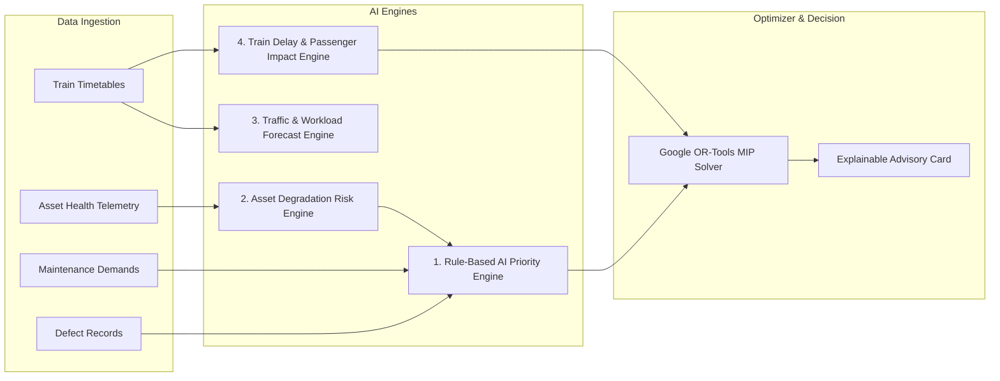

# RAILOPT AI — AI & Predictive Analytics Architecture
**Smart India Hackathon (SIH) — AI Engines & Model Formulation**
*Demonstration Environment • Synthetic Railway Operations Data*

---

> [!IMPORTANT]
> **SYNTHETIC DEMONSTRATION & BASELINE MODELS DISCLAIMER**
> The demonstration AI models in this prototype utilize synthetic railway operational data and transparent, explainable baseline approaches. Railway-grade field deployment would require training on multi-year historical railway maintenance datasets, sensor validation (e.g. OMS, USFD cars), and formal railway safety certification.

---

## 1. AI Architecture Overview

The RAILOPT AI intelligence layer consists of four cooperative modules designed for transparency, mathematical rigor, and human-in-the-loop auditability:

---

## 2. Engine Formulations

### 2.1 Rule-Based AI Priority Engine
Computes a composite priority score $P \in [0, 100]$ using a weighted 7-factor linear model with safety override triggers:

$$P = \sum_{i=1}^{7} w_i \cdot F_i$$

#### Weight Distribution:
1. **Asset Criticality ($w_1 = 0.20$)**: Evaluates corridor throughput importance and asset classification (Mainline vs Yard).
2. **Defect Severity ($w_2 = 0.25$)**: Ultrasonic flaw rating or switch failure classification (`CRITICAL` = 1.0, `MAJOR` = 0.65, `MINOR` = 0.30).
3. **Urgency & Days Overdue ($w_3 = 0.20$)**: Non-linear penalty scaling for overdue maintenance intervals:
   $$F_3 = \min\left(1.0, \frac{\text{Days Overdue}}{14}\right)$$
4. **Safety Impact ($w_4 = 0.15$)**: Evaluates derailment risk and track geometry deviations.
5. **Train Headway Impact ($w_5 = 0.10$)**: Evaluates timetable density on the target corridor.
6. **Failure Probability ($w_6 = 0.05$)**: Projected likelihood of imminent asset breakdown.
7. **Weather / Environmental Vulnerability ($w_7 = 0.05$)**: Monsoon/heat expansion adjustments.

#### Safety Override Rule:
$$\text{If } \text{DefectSeverity} = \text{CRITICAL} \implies P = \max(P, 85.0) \text{ and Priority Tier} = \text{CRITICAL}$$

### 2.2 Asset Degradation Risk Engine
Models health degradation over cumulative Gross Million Tonnes (GMT) and elapsed inspection days:

$$\text{Health}(t) = \text{Health}_0 \cdot e^{-\lambda t} - \gamma \cdot \text{GMT}$$
$$\text{Risk Level} = \begin{cases}
\text{CRITICAL} & \text{if } \text{Health} < 40 \\
\text{HIGH} & \text{if } 40 \le \text{Health} < 65 \\
\text{MEDIUM} & \text{if } 65 \le \text{Health} < 80 \\
\text{LOW} & \text{if } \text{Health} \ge 80
\end{cases}$$

### 2.3 Train Delay & Passenger Impact Engine
Simulates passenger delay minutes and sectional congestion when a track block occupies corridor $C$ during interval $[T_{\text{start}}, T_{\text{end}}]$:

$$\text{Total Delay} = \sum_{t \in \text{Trains}} \left( \Delta_{\text{Detour}}(t) + \Delta_{\text{Regulated}}(t) + \Delta_{\text{SpeedRestriction}}(t) \right)$$

---

## 3. Explainability & Trust
Every AI recommendation generated by RAILOPT AI includes an **Explainability Payload**:
- Relative weight contributions for each factor.
- Plain-English justification (e.g. *"Priority elevated to CRITICAL due to active ultrasonic rail defect on high-density freight spine"*).
- Expected operational benefits (e.g. *"Consolidates 3 tasks, saving 150 minutes of track occupancy"*).
