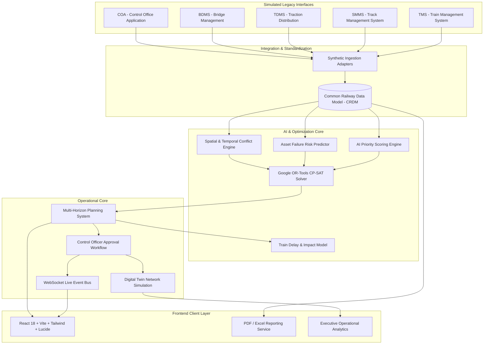

# RAILOPT AI — System Architecture
**Smart India Hackathon (SIH) — Automated Railway Block Planning & Operational Intelligence**
*Demonstration Environment • Synthetic Railway Operations Data*

---

## 1. System Topology Overview

**RAILOPT AI** is engineered as a modern, decoupled, multi-tier railway decision-support platform designed to bridge fragmented departmental silos (Engineering, Signalling & Telecom, Traction) and compute mathematically optimal railway maintenance blocks.

---

## 2. Layer-by-Layer Architectural Breakdown

### 2.1 Simulated Integration Layer
- **Role**: Ingests disparate legacy feeds into a unified schema.
- **Adapters**:
  - `TMSAdapter`: Ingests passenger train timetables, freight movements, and sectional headway limits.
  - `SMMSAdapter`: Ingests ultrasonic flaw detections (USFD), track geometry indices (TGI), and sleeper conditions.
  - `TDMSAdapter`: Ingests OHE power feeding sections, transformer ratings, and power isolations.
  - `BDMSAdapter`: Ingests bridge maintenance demands and speed restrictions.
  - `COAAdapter`: Ingests controller shift logs and emergency line possession requests.
- *Notice: In this demonstration prototype, all external interfaces utilize robust synthetic adapters conforming to Indian Railways standards.*

### 2.2 Common Railway Data Model (CRDM)
- **Role**: Normalized, transactional storage of railway assets, operational topology, and block demands.
- **Backing Store**: PostgreSQL with relational constraints, foreign keys, and indexed spatial-temporal coordinates.

### 2.3 AI Intelligence & Risk Modeling Tier
1. **Rule-Based AI Priority Engine**: Evaluates asset criticality, defect urgency, days overdue, and passenger line density to compute a deterministic composite score (0–100).
2. **Degradation Risk Engine**: Uses wear baselines and operational tonnage load to project probability of failure within 7, 14, and 30-day horizons.
3. **Conflict & Safety Engine**: Evaluates 4-dimensional overlap (Corridor $\times$ Track Segment $\times$ Time Window $\times$ Traction Power Section) to prevent unsafe concurrent track possessions.

### 2.4 Google OR-Tools Mathematical Optimization Tier
- **Algorithm**: Constraint Programming — Satisfiability (CP-SAT) integer programming.
- **Decision Variables**: Binary window assignment variables $x_{t, w}$ and department bundling indicators $y_{w, c}$.
- **Objective Function**:
  $$\text{Maximize } \sum \text{Priority}_t \cdot x_{t,w} + \text{Bonus}_{\text{Bundled}} \cdot y_{w,c} - \text{Penalty}_{\text{Train Delay}} \cdot \text{Delay}_{w}$$
- **Runtime Performance**: Resolves 24-hour multi-corridor daily block plans in $< 650\text{ ms}$.

### 2.5 Operational & Simulation Tier
- **Multi-Horizon Planner**: Interactive planning boards supporting 24h Daily, 7-day Weekly, and 30-day Monthly views.
- **Digital Twin Simulation**: Discrete-event virtual clock simulating live train progression, headway buffering, track possessions, and sudden incident injection.
- **WebSocket Event Bus**: Pub/Sub broadcasting real-time operational notifications, block status updates, and headway warnings without page refresh.

### 2.6 Security & Presentation Tier
- **Authentication**: JWT access token rotation and opaque database-hashed refresh tokens.
- **Role-Based Access Control**: 8 discrete railway operational roles enforcing authorization before API execution.
- **Human-in-the-Loop Safety**: AI produces recommendations and optimized drafts; formal approval is exclusively restricted to the **Control Officer**.
