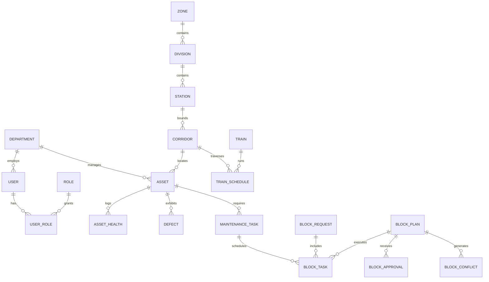

# RAILOPT AI — Common Railway Data Model (CRDM)
**Smart India Hackathon (SIH) — Entity-Relationship & Schema Reference**
*Demonstration Environment • Synthetic Railway Operations Data*

---

## 1. Data Model Overview

The **Common Railway Data Model (CRDM)** is structured into 6 relational clusters covering administrative governance, physical topology, asset inventory & health, maintenance workflows, block planning & optimization, and simulation telemetry.

---

## 2. Relational Entity Reference

### 2.1 Governance & Security Entities
- **`users`**: Platform user accounts (`id`, `username`, `email`, `hashed_password`, `full_name`, `department_id`, `is_active`, `failed_login_attempts`, `locked_until`, `last_login_at`).
- **`roles`**: System operational roles (`id`, `code`, `name`, `description`).
- **`permissions`**: Granular platform access tokens (`id`, `code`, `resource`, `action`, `description`).
- **`user_roles`**: Many-to-many junction mapping users to operational roles.
- **`role_permissions`**: Junction mapping roles to authorized system permissions.
- **`refresh_tokens`**: Opaque token store with SHA-256 hash storage, expiration dates, and revocation tracking.

### 2.2 Infrastructure & Asset Hierarchy
- **`zones`**: Railway Zones (e.g. Northern Railway, Western Railway).
- **`divisions`**: Operational Divisions (e.g. Delhi Division, Mumbai Division).
- **`stations`**: Stations, junctions, and terminal yards (`station_code`, `name`, `latitude`, `longitude`, `number_of_platforms`).
- **`corridors`**: High-density railway corridors and double-line sections (`corridor_code`, `name`, `source_station_id`, `dest_station_id`, `length_km`, `track_type`, `speed_limit_kmh`, `line_capacity_trains_per_day`).
- **`assets`**: Base asset table (`asset_code`, `name`, `asset_type`, `department_id`, `corridor_id`, `km_start`, `km_end`, `status`, `criticality_score`).
- **Sub-Asset Tables**: Specialized attributes for `track_assets`, `signal_assets`, `telecom_assets`, `ohe_assets`, `feeders`, `transformers`, `substations`, and `point_machines`.

### 2.3 Condition Monitoring & Maintenance
- **`asset_health`**: Condition telemetry records (`asset_id`, `health_score`, `recorded_at`, `temperature_c`, `vibration_mm_s`, `track_geometry_index`).
- **`inspections`**: Ultrasonic flaw testing and physical inspection logs (`asset_id`, `inspection_type`, `inspected_at`, `findings`, `recommended_action`).
- **`defects`**: Infrastructure anomalies and safety hazards (`defect_code`, `asset_id`, `severity`, `status`, `detected_at`, `resolved_at`, `speed_restriction_kmh`).
- **`maintenance_tasks`**: Backlog of scheduled and corrective work demands (`task_code`, `asset_id`, `department_id`, `task_type`, `priority`, `status`, `duration_minutes`, `due_at`, `is_safety_critical`).
- **`maintenance_history`**: Completed maintenance log records with field crew notes.

### 2.4 Traffic & Timetable
- **`trains`**: Master train catalog (`train_number`, `train_name`, `train_type`, `priority_tier`, `max_speed_kmh`).
- **`train_schedules`**: Station-by-station timetables (`train_id`, `corridor_id`, `station_id`, `arrival_time`, `departure_time`, `halt_duration_minutes`).
- **`train_movements`**: Live sectional movement observations for delay calculations.
- **`goods_forecasts`**: Freight throughput and container movement projections.

### 2.5 Block Planning & Optimization
- **`block_requests`**: Departmental block demands (`request_code`, `department_id`, `corridor_id`, `preferred_start_at`, `preferred_end_at`, `duration_minutes`, `status`, `priority`).
- **`block_plans`**: Master block schedules (`plan_code`, `corridor_id`, `start_time`, `end_time`, `status`, `optimization_run_id`, `plan_type`).
- **`block_tasks`**: Tasks allocated inside a coordinated block window (`block_plan_id`, `maintenance_task_id`, `sequence_order`, `planned_duration_minutes`).
- **`block_conflicts`**: Recorded spatial, temporal, or traction conflicts (`block_plan_id`, `conflict_type`, `severity`, `description`, `resolution_strategy`).
- **`block_approvals`**: Formal controller review audit (`block_plan_id`, `action`, `approved_by`, `comments`, `decided_at`).

### 2.6 AI Predictions & Simulation Telemetry
- **`asset_risk_predictions`**: Failure probability outputs from risk models.
- **`ai_predictions`** & **`ai_recommendations`**: Composite priority scores and shadow block consolidation advisories.
- **`optimization_runs`** & **`optimization_results`**: Mathematical solver metrics, objective values, and feasibility reports.
- **`simulation_scenarios`**, **`simulation_runs`**, **`simulation_events`**: Digital Twin execution trajectories, incident logs, and KPI deltas.
- **`notifications`**: System and user operational alert feed.
- **`audit_logs`**: Immutable security and mutation event trail.
