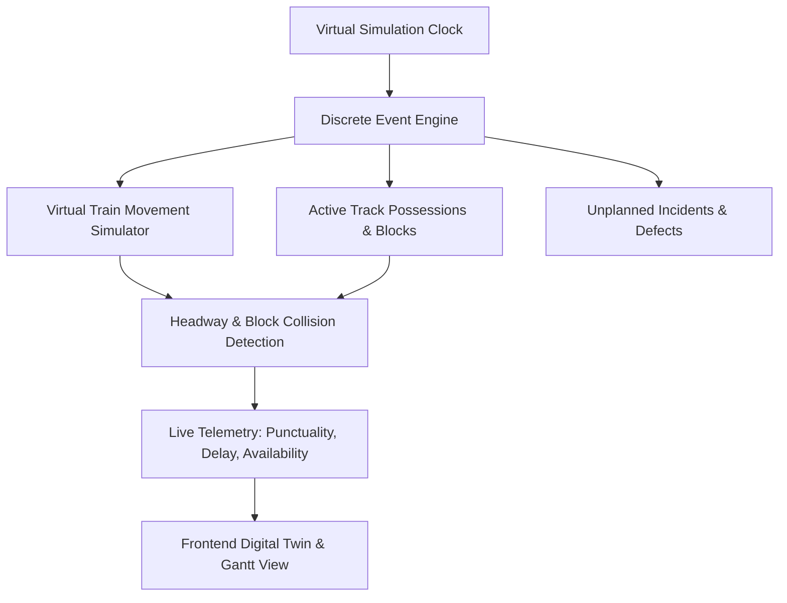

# RAILOPT AI — Digital Twin & Network Simulation
**Smart India Hackathon (SIH) — Virtual Network Execution Engine**
*Demonstration Environment • Synthetic Railway Operations Data*

---

> [!CAUTION]
> **SIMULATION BOUNDARY NOTICE**
> The Digital Twin is a discrete-event software simulation environment built purely for demonstration, what-if evaluation, and mathematical validation. It is **NOT** connected to live signaling, point machine interlockings, or real train controllers.

---

## 1. Digital Twin Architecture

The Digital Twin provides a real-time virtual replica of the synthetic railway network:

---

## 2. Core Capabilities

### 2.1 Discrete Event Simulation Loop
- **Virtual Clock**: Advances in customizable steps (e.g. 15-minute or 1-hour increments).
- **Train Movement**: Simulates train acceleration, deceleration, scheduled station halts, and speed restrictions across corridor track segments.
- **Dynamic Headway Regulation**: If a train approaches an active track possession, the engine models signal regulation (stopping at previous signal or reducing speed).

### 2.2 What-If Scenario Evaluation
Planners can clone the baseline operational schedule and execute parameterized What-If runs:
- **Scenario 1: Baseline Plan (Separate Blocks)**: Engineering, S&T, and Traction take 3 disjoint track possessions.
- **Scenario 2: Optimized Plan (Shadow Bundling)**: All 3 departments share a single 120-minute shadow block.
- **Comparative KPIs**:
  - *Corridor Downtime Saved*: +150 minutes
  - *Train Delay Reduction*: -68%
  - *Asset Availability Increase*: +3.4%

---

## 3. Simulation Control API
- `POST /api/v1/simulation/run`: Initialize new simulation run for a target date and corridor.
- `POST /api/v1/simulation/{id}/step`: Advance the virtual clock by `step_minutes`.
- `POST /api/v1/simulation/{id}/pause`: Freeze simulation clock.
- `POST /api/v1/simulation/{id}/reset`: Reset network to initial state.
- `POST /api/v1/simulation/what-if/evaluate`: Compute multi-criteria ranking between competing plans.
