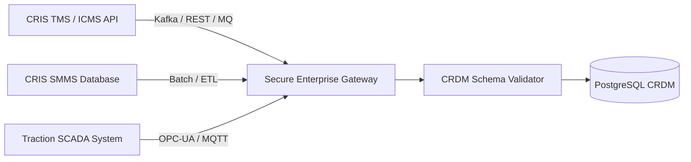

# RAILOPT AI — Legacy Railway Integration Layer
**Smart India Hackathon (SIH) — Integration Adapters & Enterprise Roadmap**
*Demonstration Environment • Synthetic Railway Operations Data*

---

## 1. Integration Strategy

In Indian Railways operations, key data is segregated across multiple legacy software suites:

| Legacy System | Domain | Data Ingested by RAILOPT AI |
| :--- | :--- | :--- |
| **TMS** (Train Management System) | Train Control & Timetable | Real-time train positions, timetable schedules, delays, section headways |
| **SMMS** (Track Management System) | Track & Permanent Way | Rail defects, USFD inspection logs, Track Geometry Index (TGI) |
| **TDMS** (Traction Distribution) | Electrical & OHE | OHE feeding sections, power substations, isolation requirements |
| **BDMS** (Bridge Management) | Structural & Bridges | Bridge health inspections, speed restrictions, structural repairs |
| **COA** (Control Office Application) | Operational Authority | Emergency possession requests, controller logbooks, section occupancy |

---

## 2. Demonstration Implementation (Mock Adapters)

In the current demonstration prototype, all external interfaces are implemented via modular synthetic adapters:

```python
# Conceptual Architecture (backend/app/integrations/adapters.py)

class TMSAdapter:
    def fetch_train_timetables(self, corridor_id: str) -> list[dict]:
        """Fetches timetable schedules conforming to Indian Railways standards."""
        ...

class SMMSAdapter:
    def fetch_track_defects(self, corridor_id: str) -> list[dict]:
        """Fetches ultrasonic flaw inspection records and rail wear indices."""
        ...

class TDMSAdapter:
    def fetch_power_sections(self, corridor_id: str) -> list[dict]:
        """Fetches OHE electrical feeding and isolation boundaries."""
        ...
```

---

## 3. Enterprise Integration Roadmap

To transition RAILOPT AI from prototype to production railway deployment:



1. **Phase 1: API Gateway & CRIS Federation**: Interface with Centre for Railway Information Systems (CRIS) secure REST/SOAP APIs.
2. **Phase 2: Real-time Telemetry (SCADA/OHE)**: Direct ingestion of traction breaker status via OPC-UA/MQTT.
3. **Phase 3: Sensor Data (USFD / Track Recording Cars)**: Direct ingestion of raw track geometry sensor files.
