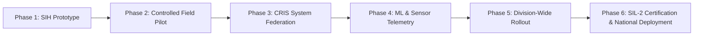

# RAILOPT AI — Production Roadmap & Evolution Strategy
**Smart India Hackathon (SIH) — Phase-by-Phase Industrialization Plan**
*Demonstration Environment • Synthetic Railway Operations Data*

---

---

## 1. Roadmap Milestones

### Phase 1: SIH Prototype (Current Completed Baseline)
- ✅ Common Railway Data Model (CRDM) across 45+ tables.
- ✅ Multi-factor AI priority scoring & asset failure risk projection.
- ✅ Google OR-Tools CP-SAT multi-department shadow block optimizer.
- ✅ Digital Twin discrete-event network simulation & What-If scenario builder.
- ✅ Full Dockerization, automated test suites (123 tests), and RBAC security.

### Phase 2: Controlled Field Pilot (Months 1–6)
- Deploy platform in a sandbox division control office (e.g. Delhi or Mumbai Division).
- Parallel shadow running alongside manual planning for 90 days.
- Compare manual controller block schedules vs AI-recommended shadow blocks.

### Phase 3: CRIS System Federation (Months 6–12)
- Interface with CRIS (Centre for Railway Information Systems) secure gateways.
- Ingest live ICMS/TMS timetable feeds and COA controller electronic logbooks.
- Ingest real Track Recording Car (TRC) and USFD defect databases.

### Phase 4: Machine Learning & Sensor Telemetry (Months 12–18)
- Train neural network and XGBoost degradation models on historical railway maintenance logs.
- Integrate real-time SCADA telemetry for OHE power feed isolations.

### Phase 5: Railway Safety Certification (Months 18–24)
- Formal audit against Indian Railways Indian Railway Technical and Operational Standards.
- CENELEC EN 50128/50129 software safety integrity assessment.
- Division-wide national deployment across all 18 Indian Railway Zones.
